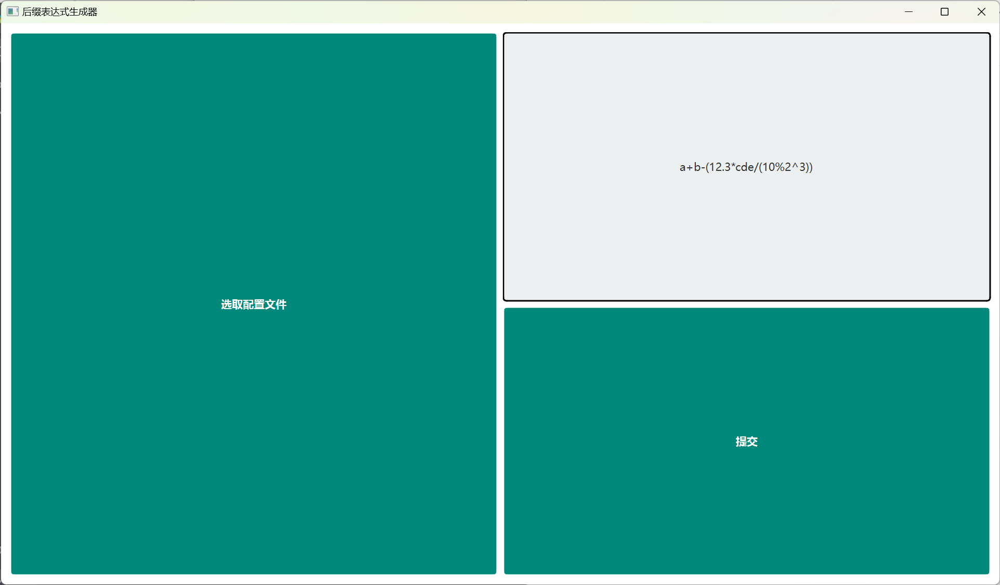
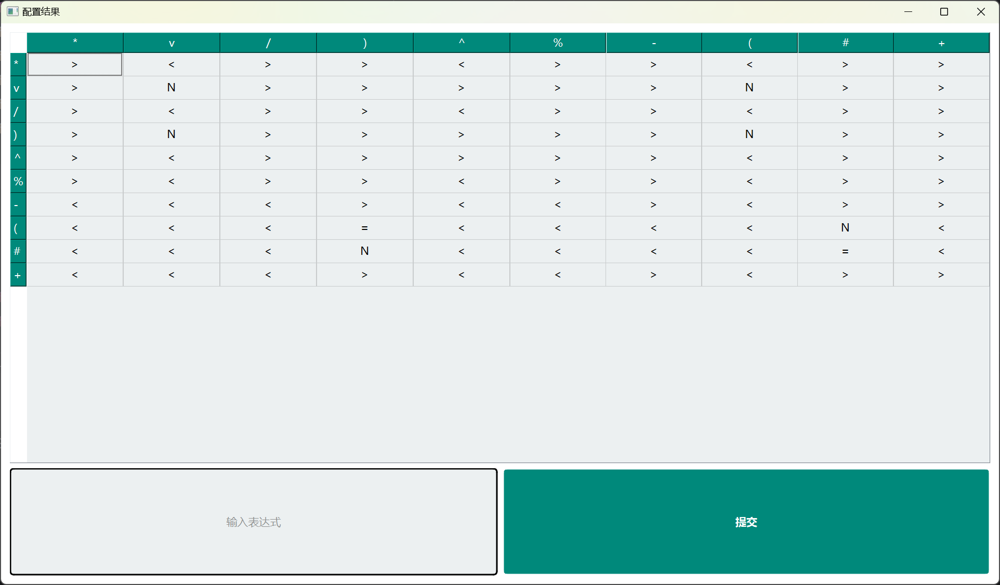
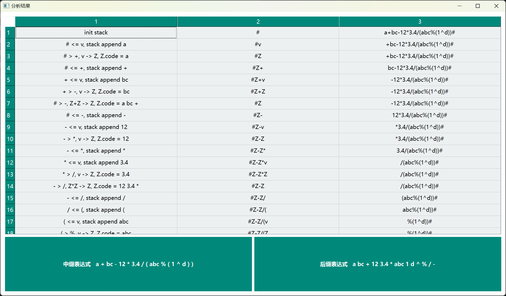

# InfixToPostfix

A python module converts infix expressions to postfix expressions and includes a visual interface

## Table of Contents

- [Install](#install)
- [Usage](#usage)
- [License](#license)

## Install

```shell
$ pip install InfixToPostfix
```

## Usage

### No visual interface

```python
from InfixToPostfix.infix_to_postfix import InfixToPostfix

infix_to_postfix = InfixToPostfix()
expression = "a+b-(12.3*cde/(10%2^3))"
result, words, actions, stack_states, words_states = infix_to_postfix.analyze(expression)
print(result, words, actions, stack_states, words_states, sep="\n")
```

### With visual interface

```python
import sys

from PyQt6.QtWidgets import QApplication
from InfixToPostfix.ui import MainWindow

app = QApplication(sys.argv)
window = MainWindow()
sys.exit(app.exec())
```







## License

[GPL-3.0](./LICENSE) © [RoiexLee](http://roiexlee.github.io) 